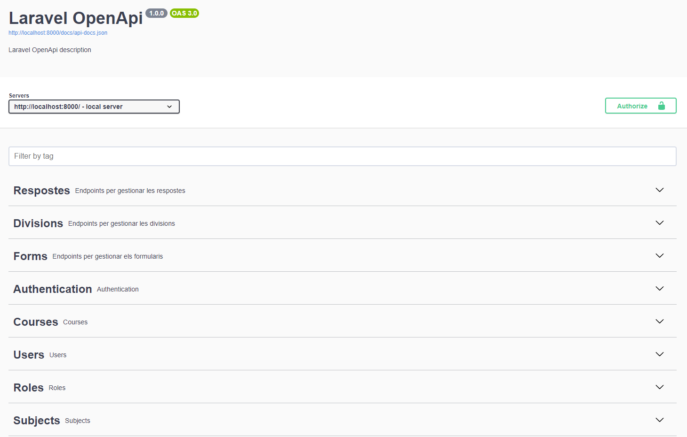

# Grupify
**Integrants del projecte:**
Aleiram Minaya, Lucas Benitez, Araceli Pacheco, Joselyn Ninahuaman, Adrià Estévez.

##Gestió Educativa Intel·ligent per a Professors

Benvingut a **Grupify**, una plataforma integral dissenyada per a empoderar als professors en la gestió de les seves classes, alumnes i projectes grupals, potenciada amb eines de IA per a simplificar i optimitzar el treball educatiu!

## ✨ *Funcionalitats Principals*

### *📢 Comunicació Eficient*
- Enviament de notificacions directes als alumnes des del panell del professor.

### *👥 Gestió d'Alumnes i Grups*
- *Vista detallada d'alumnes*: Fitxes individuals amb dades acadèmiques i gràfics d'autoavaluació.
- *Creació i gestió de grups*: Afegeix o elimina membres manualment, afegeix comentaris del professor i utilitza bitàcoles compartides per a projectes estudiantils.

### *📋 Assistent de IA per a Formularis*
- *Crea formularis intel·ligents*: Usa prompts naturals per a generar qüestionaris personalitzats, edita preguntes, regenera seccions i guarda/descarrega plantilles en JSON.
- *Assignació flexible*: Distribueix formularis per curs, programa dates d'expiració i accedeix a respostes organitzades per alumne.

### *🔍 Sociograma Interactiu*
- *Analitza dinàmiques socials*: Genera visualitzacions amb fletxes verdes/vermelles per a relacions positives/negatives entre alumnes, identifica rols i competències mitjançant respostes a formularis específics.

### *🤖 Agent de IA per a Professors*
- *Assistència intel·ligent*: Consulta dubtes, puja arxius per a anàlisi contextual i crea grups automàticament usant prompts (basats en sociogrames, CESC o altres criteris).

---

## 🚀 *Per què Grupify?*
- *Eficiència*: Automatitza tasques repetitives (formularis, grups) amb IA.
- *Insights profunds*: Visualitza dades acadèmiques i socials en gràfics i sociogrames.
- *Flexibilitat*: Personalitza cada aspecte, des de formularis fins a comentaris en grups.
- *Innovació*: Integració de bots i generació de contingut assistit per IA.

---

## 🛠 *Començar és fàcil*
1. *Configura cursos i alumnes* des del panell del professor.
2. *Prova l'Assistent de IA* per a crear el teu primer formulari en segons.
3. *Explora el sociograma* per a entendre les dinàmiques de la teva classe.
4. *Conversa amb l'Agent de IA* per a resoldre dubtes o generar grups automàtics.

Taiga: https://tree.taiga.io/project/aleiram19-2daw_projectefinal_grupify/timeline
Penpot: https://design.penpot.app/#/view/7ad540b5-8190-815d-8005-5ce4491a439f?page-id=7ad540b5-8190-815d-8005-5ce4491a43a0&section=interactions&index=0&share-id=0b127ab7-8934-814e-8005-bc502dc95691

URL Producció (proxy invers): https://grupify.cat | https://api.grupify.cat

## 🐳 Projecte amb Vue, Nodejs + Laravel 🐳

1. **Clona el projecte**
    ```bash
    git clone https://github.com/inspedralbes/prj-final-grupify.git
## 🚀 Requisits

Abans de començar, assegura't de tenir instal·lat el següent component:

- **Docker**: [Guía d'instalació oficial](https://docs.docker.com/get-docker/)
- Utilitza aquesta comanda per evitar fer `sudo` cada vegada que utilitzes docker
    ```bash
    sudo usermod -aG docker $USER
**Configuració abans d'aixecar els serveis**

> **Nota**: Suposem que el projecte està clonat en el teu directori home (~/).
> Si ho tens en una altra ubicació, ajusta les rutes segons correspongui.
- Configuració .env de laravel (backend) | Base de dades
    ```bash
    cd ~/prj-final-grupify/backend
    DB_CONNECTION=mysql
    DB_HOST=db #Nom del servei a Docker
    DB_PORT=3306
    DB_DATABASE=
    DB_USERNAME=
    DB_PASSWORD=
- Configuració .env de Laravel (backend) | Redis
    ```bash
    cd ~/prj-final-grupify/backend
    REDIS_CLIENT=phpredis
    QUEUE_CONNECTION=redis
    REDIS_HOST=redis
    REDIS_PASSWORD=
    REDIS_PORT=6379
- Configuració .env de Nuxt (frontend)
    ```bash
    cd ~/prj-final-grupify/frontend
    cp .env.example .env
    GOOGLE_CLIENT_ID=
    API_BASE_URL=http://localhost:8000 #URL de Laravel
**Aixeca els serveis per desenvolupament de forma senzilla (Nuxt, Node, Laravel, Redis, MySQL, Adminer)**
- Les **comandes principals** per obrir el projecte de forma ràpida i segura.
    ```bash
    cd prj-final-grupify
    docker compose -f docker-compose.yml up # Encendre els contenidors
    docker compose -f docker-compose.yml down # Apagar els contenidors
Aquest projecte utilitza Docker per gestionar de manera senzilla els serveis.

---

## Documentació Laravel (APIs)
Aquest projecte utilitza swagger com a eina per documentar de manera visual les APIs creades. 

Pots **veure tota la informació** fent docker compose up (comprova que laravel està en funcionament) i entras a **"localhost:8000/api/documentation"**


Proporcionem informació sobre:

1. Totes les rutes existents
2. Les taules utilitzades
3. En quina ruta es realitza cada petició
4. Requeriments al body (si es obligatori o no)
5. Quin Schema has d'utilitzar al body
    ```bash
    {
        "email": "adria@inspedralbes.cat",
        "password": "password123",
    }
6. Tipus de petició (POST, GET, PUT, DELETE)
7. Descripció de cada peticio
8. Descripció de cada resposta amb el seu codi corresponent (200 = Exitós. 404 = No trobat...)
9. Parametres necessaris per cada API en particular
    ```bash
    localhost:8000/api/courses/{id} #ID del curs sería un paràmetre obligatori.
---

# 📂 Estructura del projecte
El projecte està dividit en dos directoris principals:

- **Backend/:** Conté el codi i els serveis per al backend (laravel / nodejs).
- **Backend/node-app:** Conte el nodejs dins del back
- **Frontend/:** Conté el codi i els serveis per al frontend (Nuxt3).

# Convenciones para los Commits
chore: Cambios menores que no afectan el código de producción, como actualizaciones de dependencias o tareas de mantenimiento.
```
chore: update dependencies
```
docs: Cambios relacionados con la documentación del proyecto
```
docs: update README with new setup instructions
```
fix: Corrección de errores en el código que solucionan problemas identificados
```
fix: resolve issue with user authentication
```
feat: Adición de nuevas funcionalidades o características al proyecto.
```
feat: add user profile page
```
refactor: Cambios en el código que mejoran la estructura o el rendimiento sin modificar la funcionalidad.
```
refactor: simplify user authentication logic
```
test: Añadir o modificar pruebas en el proyecto.
```
test: add unit tests for user profile component
```
